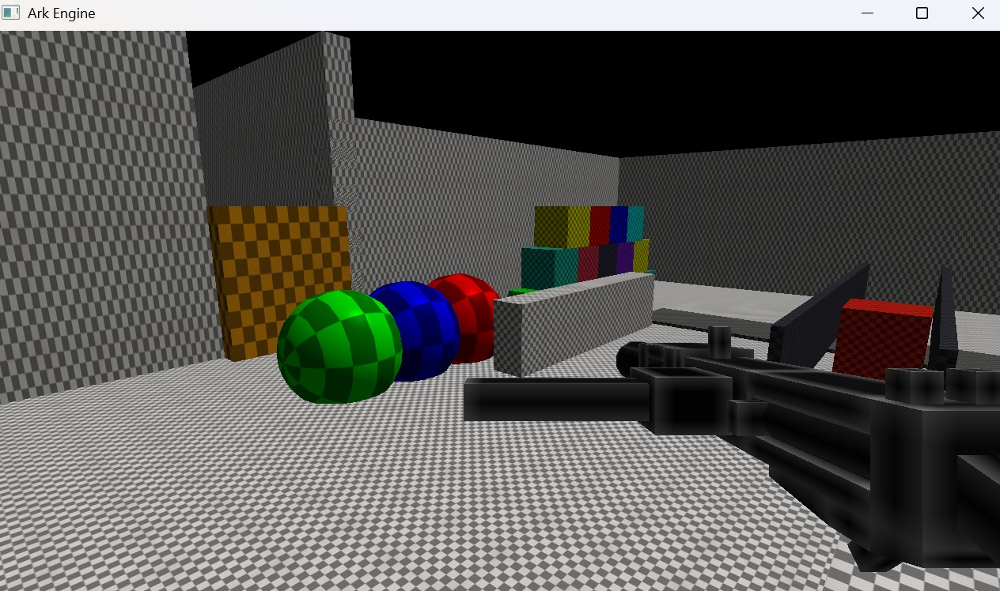
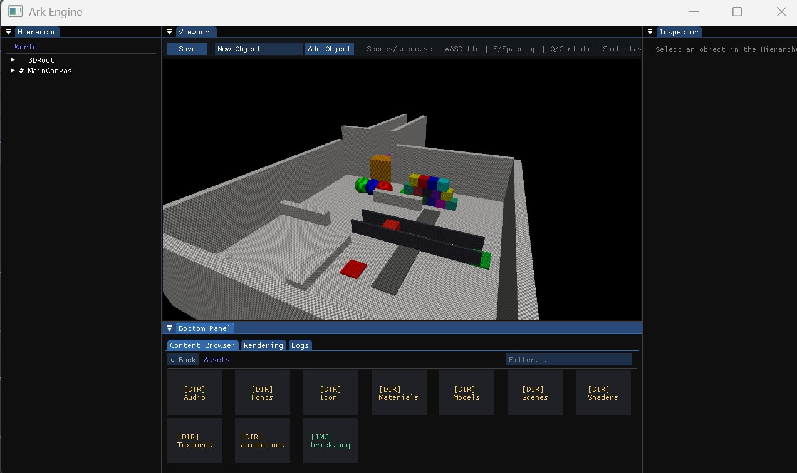

# ArkEngine

ArkEngine — a custom 3D game engine written in C++



## Features

**Rendering**
- OpenGL 3.3 Core rendering through GLFW and GLAD.
- Scene rendering into a framebuffer object for editor viewport display or screen blitting.
- Optional deferred rendering path with geometry, shadow, and lighting passes.
- G-buffer attachments for world position, normal, and albedo/specular data.
- Directional and point light data collection from the scene graph.
- Shadow mapping for directional lights with a 2048x2048 depth map and 3x3 PCF filtering.
- Specular lighting with global specular strength control and optional `specularMap` material texture.
- Forward rendering fallback through the default material shader path.
- Runtime wireframe mode, depth test, viewport, clear color, and blend mode controls.
- 3D mesh, 2D sprite, and UI draw submission through `RenderQueue`.
- Runtime mipmap filter control for loaded asset textures.

**Editor**
- In-engine Dear ImGui editor with docking enabled.
- Docked Hierarchy, Viewport, Inspector, and Bottom Panel layout.
- Bottom Panel tabs for Content Browser, Rendering, and Logs.
- Viewport panel renders the engine scene FBO.
- Hierarchy supports selecting objects, creating children, duplicating objects, and deleting objects.
- Inspector supports object active state, name, transform editing, component listing, component removal, and registered component creation.
- Rendering tab exposes deferred rendering, mipmap filter, and specular strength controls.
- Logs tab captures engine log messages with level filters and auto-scroll.
- Menu, Play, and Edit application modes.
- Edit mode uses an editor fly camera.

**Scene System**
- `Scene` owns root `GameObject` instances and supports parent/child hierarchy changes.
- `GameObject` supports active state, lifetime marking, local/world transforms, components, and serialized JSON data.
- Component factory registration for cameras, lights, meshes, physics, audio, sprites, UI, animation, and player controller components.
- Scene save/load through nlohmann/json.
- Scene main camera selection by serialized camera object name.
- Active UI canvas lookup by serialized canvas object name.
- GLTF scene/object loading through `GameObject::LoadGLTF`.
- Transform animation clips with translation, rotation, and scale tracks.

**Physics**
- Bullet Physics integration through `PhysicsManager`.
- Bullet broadphase, collision configuration, dispatcher, solver, and discrete dynamics world ownership.
- Rigid body add/remove and per-frame physics updates.
- Physics component, colliders, rigid bodies, collision objects, and kinematic character controller are public engine systems.

**Audio**
- miniaudio engine ownership through `AudioManager`.
- Listener position updates.
- Audio and audio listener components are public engine systems.

**UI**
- Dear ImGui editor UI with docking.
- Runtime UI systems for canvas, text, UI element, button, rect transform, and UI input components.
- UI render submission supports batched indexed drawing with optional textures.
- FreeType-backed font manager with font caching by path and size.

**Asset Pipeline**
- Asset file access through the engine file system.
- GLTF/GLB loading through cgltf, including node transforms, mesh primitives, material textures, and animation clips.
- Assimp mesh loading fallback for non-GLTF mesh files.
- Content Browser recognizes directories, images, materials, scenes, audio files, and mesh files.
- Mesh assets can be drag-dropped from the Content Browser onto mesh components.
- Materials load from JSON with shader paths, float/float2/float3 parameters, and texture parameters.
- Scene files use `.sc` JSON; material files use `.mat` JSON.

## Tech Stack

| Library | Purpose |
| --- | --- |
| Language | C++17 |
| Graphics API | OpenGL 3.3 Core |
| Windowing | GLFW |
| Extension loading | GLAD |
| Math | GLM |
| UI | Dear ImGui with docking |
| Physics | Bullet Physics |
| Audio | miniaudio |
| Model loading | cgltf, Assimp |
| Font rendering | FreeType |
| JSON | nlohmann/json |

## Architecture Overview

`ArkEngine` is a singleton that owns the main application, window, input manager, graphics API, render queue, deferred renderer, file system, texture manager, mesh manager, physics manager, audio manager, font manager, UI input system, and current scene. The core loop updates physics and UI input, updates the application, renders the scene into an FBO or deferred output, draws the editor UI, then swaps the GLFW buffers.

Scenes are built from a `Scene` / `GameObject` / `Component` hierarchy. A scene owns root objects, objects can own children and components, and registered object/component factories recreate serialized types during load. Scenes collect lights recursively and resolve the serialized main camera and active canvas by object name.

Rendering is submitted through `RenderQueue` commands for 3D meshes, 2D sprites, and UI batches. The engine can render queued 3D commands through the deferred renderer first, then draw remaining 2D/UI commands, or use the forward path directly when deferred rendering is disabled.

## Getting Started

### Prerequisites

<!-- TODO: fill in prerequisites -->
You need Visual Studio 2020 or above , i would choose above.

### Building

You need to compile the project once to expose the [Export] folder.
Please note: only Debug works. I did not get the dlls for the release to function properely.
In that you will get the exe and lib folders. However you need to copy the resource folder and paste in there aswell.
<!-- TODO: fill in build instructions. CMake is assumed. -->

### Running
Press the green button and have fun i guess
<!-- TODO: fill in run instructions -->

## Scene File Format

Scenes are stored as `.sc` JSON files. Materials are stored as `.mat` JSON files and can reference shader files, numeric parameters, and textures.

Basic scene shape:

```json
{
  "name": "ExampleScene",
  "camera": "MainCamera",
  "activeCanvas": "HUDCanvas",
  "objects": [
    {
      "name": "MainCamera",
      "position": { "x": 0.0, "y": 2.0, "z": 5.0 },
      "rotation": { "x": 0.0, "y": 0.0, "z": 0.0, "w": 1.0 },
      "scale": { "x": 1.0, "y": 1.0, "z": 1.0 },
      "components": [
        { "type": "CameraComponent" }
      ]
    },
    {
      "name": "Sun",
      "position": { "x": 0.0, "y": 4.0, "z": 0.0 },
      "rotation": { "x": 0.0, "y": 0.0, "z": 0.0, "w": 1.0 },
      "scale": { "x": 1.0, "y": 1.0, "z": 1.0 },
      "components": [
        {
          "type": "directional",
          "componentType": "LightComponent",
          "color": { "r": 1.0, "g": 1.0, "b": 1.0 },
          "intensity": 1.0,
          "range": 10.0
        }
      ]
    },
    {
      "name": "Model",
      "type": "gltf",
      "path": "Models/model.gltf",
      "position": { "x": 0.0, "y": 0.0, "z": 0.0 },
      "rotation": { "x": 0.0, "y": 0.0, "z": 0.0, "w": 1.0 },
      "scale": { "x": 1.0, "y": 1.0, "z": 1.0 },
      "children": [
        {
          "name": "Child",
          "position": { "x": 1.0, "y": 0.0, "z": 0.0 },
          "rotation": { "x": 0.0, "y": 0.0, "z": 0.0, "w": 1.0 },
          "scale": { "x": 1.0, "y": 1.0, "z": 1.0 }
        }
      ]
    }
  ]
}
```

## Editor Usage

The application starts in Menu mode with UI buttons for Play, Edit, and Quit. Play mode disables the menu canvas, enables the game scene, restores the game camera, and locks the cursor. Edit mode disables gameplay/player control, enables the docked editor, switches the main camera to the editor camera, and renders the scene in the editor viewport. Escape returns from Play or Edit mode to Menu mode.

Editor layout:
- Hierarchy: scene object tree and object context actions.
- Viewport: rendered scene FBO, save button, add-object control, scene path, and camera hints.
- Inspector: selected object state, transform, components, and add/remove controls.
- Bottom Panel: Content Browser, Rendering, and Logs tabs.

Editor camera controls:
- WASD: fly movement.
- RMB: look.
- E or Space: move up.
- Q or Ctrl: move down.
- Shift: fast movement.

Features and Structure weaknesses and things i would have loved to add but did't. 
- Window creation: I would have loved to make the engine more modular and adaptable where i can switch between SDL / GLFW for window creation by maybe doing something like Window::SDL with it's own implementation and possibility to disconnect and reconnect things in a more adaptable fashion to make the engine.

- Threading: I did't touch threading at all in the project and it was one of my greater downfall very early in the project before so all runs on the main thread which is a poor decision on my end. 

- Performance and optimisations: I should have made more use of ints & enums for my handling and loading of things instead of strings due to the amount of bytes used, this should have improved things a fair bit. 

- Rendering: I was looking into making all of the rendering using Vulkan but it is too great of an ask to implement especially for a student like myself in this engine. Maybe adding DX11 support would have worked fine and just like in the point of window creation. I would have liked to make it possible to select which renderer to use like GraphicsAPI::Vulkan. 

- Scripting would have been really neat and nice, i could definitly see the use of making more utility macros for functions and creation of objects. I could have added Lua scripting but i just did't have the time.

- Object structure: I think i would have gone with a structure that i am more familiar with like Unreals way with UObjects and properties that can set how that thing and it's components will behave and work. I needed far better core structure to make this possible.

- Editor layer vs Gameplay. Currently it's just a silly switch but i should have written it differently to set it based on an integer in my main.cpp instead. 

- Plan for scale and not just throwing things at a wall solutions. It's a thing i learned mainly here as the project grew. It is incredibly difficult to scale a project when you have a crap foundation. 
AI can help solutions and wrap things neatly but won't be the best when it comes to implementation.

## To-Do: Define a lot more stuff already before hand to make functionality and code cleaner. It's a mess and can become difficult to dig into eventually. Especially if i was to wanna try and extend it. 
[Global Rewrite] - I would wanna follow some engine structure and pre-define a lot more stuff so that a lot more functions and objects already have functionality built in much like other engines so that they're all solid and robust and ready to extend but i struggled with scalability in this project a lot.
[Management and Performance gain] - Would likely also create subsystems instead of managers and handlers. And let every manager get a separate thread delegated to them to ease handling of logic. 
[Texture & Mesh] - Add a texture field for my mesh components where i can plug in a material/texture.
[Component System Enhancement] - Improve the component system by also including more json properties that users can set in the inspector. Currently it's minimal and barebones.
[Graphics Support Upgrade] - Attach support for vulkan and DX11
[GLFW -> SDL] - Migrate the window functionality and input towards SDL instead as SDL has more support for external platforms making it more suitable for steamdecks, switch and other controllers.
[Static Lib Tools] - Evolve more external tools as static libraries so i can separate stuff a lot better without carrying everything in one big project.
[Physics] - Probably implement the physics in a better way, it is currently one thing that slows loading of the engine down. Before it was 2 seconds. Performance is stable even though it is only using 1 thread and debug only. 
[FileSystem] - I would most likely wanna migrate from JSON loading to a more YML loading text for the sake of simpler syntax, less chaos and more structure.

## Final Notes: it's fine for what it is, i will probably return to this in the future and iterate on some things likely if my team wants to repurpose the engine. ( What every dev says and never does) 
We'll see, if my dev team actually wants to reuse the engine and invest some time into making it a bit more stable for an in-house solution then we might revamp this project in the future.


## License:
I dont give a damm, do what you want you filthy animal! :D 
